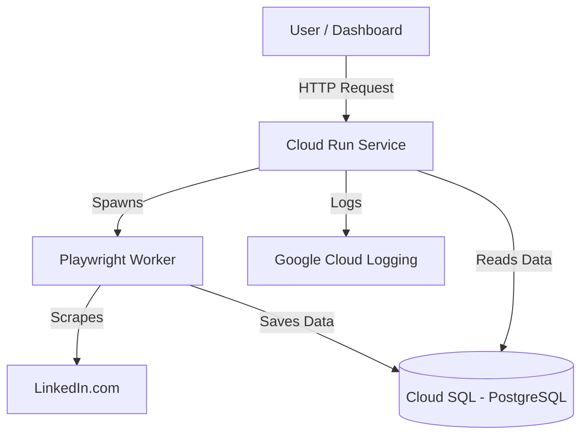

# 📘 Scooter LinkedIn Bot - Developer Documentation

## 🏗️ System Architecture

The **Scooter LinkedIn Bot** is a high-performance, containerized web application designed to automate LinkedIn actions (scraping, messaging, monitoring) at scale. It is built to run serverlessly on Google Cloud Platform (GCP).

### **High-Level Diagram**


---

## 🖥️ Backend Services

The backend is built with **FastAPI** (Python 3.11) and serves as the central control unit.

### **1. Core Application (`ui_server.py`)**
*   **Framework**: FastAPI
*   **Role**: Handles HTTP requests, serves the UI, and manages background tasks.
*   **Concurrency**: Uses `asyncio` for non-blocking I/O.
*   **Endpoints**:
    *   `GET /`: Serves the main dashboard.
    *   `POST /api/harvest`: Triggers a scraping job.
    *   `GET /api/campaigns`: Returns campaign status.

### **2. Automation Engine (`linkedin/`)**
*   **Library**: `playwright` (Chromium).
*   **Browser**: Runs in **Headless Mode** (`HEADLESS=true`) for production.
*   **Stealth**: Uses `playwright-stealth` to evade bot detection.
*   **Session Management**: Handles login, cookies, and session persistence.

---

## 🎨 Frontend (The Dashboard)

The frontend is **Server-Side Rendered (SSR)** using **Jinja2** templates, ensuring lightweight and fast loading.

*   **Templates**: Located in `ui/templates/`.
    *   `dashboard.html`: Main control panel.
*   **Assets**: CSS/JS served from `ui/static/`.
*   **Interactivity**:
    *   Uses **Vanilla JavaScript** and **HTMX patterns** (fetch API) to update the UI without full page reloads.
    *   **SSE (Server-Sent Events)**: Used for real-time logs streaming (if enabled).

---

## 🗄️ Database Schema & Storage

The system supports a **Hybrid Database Model**:
*   **Local Development**: SQLite (`assets/data/linkedin_data.db`).
*   **Production**: Google Cloud SQL (PostgreSQL 15).

### **Connection Logic (`linkedin/db/engine.py`)**
The app automatically detects the environment:
*   If `DATABASE_URL` env var is present → Connects to **PostgreSQL**.
*   If missing → Fallback to **SQLite**.

### **Key Tables (`linkedin/db/models.py`)**

| Table Name | Description | Key Columns |
| :--- | :--- | :--- |
| **profiles** | Stores scraped candidate data. | `public_identifier` (PK), `first_name`, `last_name`, `headline`, `profile_data` (JSON). |
| **jobs** | Queued tasks/campaigns. | `id` (PK), `type`, `status`, `created_at`. |
| **settings** | Account-specific configs. | `key` (PK), `value`. |

---

## ☁️ Deployment (Google Cloud)

### **1. Containerization**
*   **Docker**: The app is packaged into a single Docker image.
*   **Base Image**: `python:3.11-slim`
*   **Dependencies**: Installs `playwright` browsers (Chromium), `ffmpeg`, and system libs.

### **2. Infrastructure**
*   **Compute**: **Google Cloud Run** (Managed Service).
    *   **CPU**: 2 vCPU (required for browser).
    *   **Memory**: 2 GiB (browser is memory-intensive).
    *   **Scaling**: Auto-scales from 0 to N instances.
*   **Database**: **Cloud SQL** (PostgreSQL).
    *   **Instance**: `scooter-linkedin-db-instance`.
    *   **Connection**: Uses the **Cloud SQL Auth Proxy** (handled automatically by Cloud Run).
*   **Registry**: **Artifact Registry** (`us-central1-docker.pkg.dev/...`).

### **3. CI/CD Pipeline (`cloudbuild.yaml`)**
We use **Google Cloud Build** for automated deployments:
1.  **Build**: Creates the Docker image.
2.  **Push**: Uploads image to Artifact Registry.
3.  **Deploy**: Updates the Cloud Run service with the new image.

---

## 🛠️ Developer Workflow

### **1. Running Locally (Development)**
Before deploying, always test your changes locally to ensure everything works.
```bash
# Install dependencies (only once)
pip install -r requirements.txt
playwright install

# Run the UI Server
uvicorn ui_server:app --reload
# Access Dashboard at: http://localhost:8000
```

### **2. Saving Changes (GitHub)**
Once you are happy with your code changes, save them to the repository:
```bash
git add .
git commit -m "Describe your changes briefly (e.g. improve scraping logic)"
git push origin main
```
*   This ensures your work is backed up and versioned.

### **3. Deploying to Production (Cloud Run)**
To update the live bot with your new code, run this **single command**:
```bash
gcloud builds submit .
```
*   **What this does**:
    1.  Builds a new Docker image from your code.
    2.  Pushes it to Google Artifact Registry.
    3.  Automatically updates the Cloud Run service (`scooter-bot-service`).
    4.  Restarts the bot with your latest changes (database connections remain active).

> **Note:** The deployment takes about 2-3 minutes. Wait for the `SUCCESS` message in your terminal before closing it.

---

## 🔒 Security Notes
*   **Cookies**: Local cookies (`assets/cookies/`) are **NOT** uploaded to the cloud (excluded via `.gitignore`). You must log in freshly on the production dashboard.
*   **Passwords**: Database passwords should be stored in **Secret Manager** (future improvement), currently passed via Env Vars.
