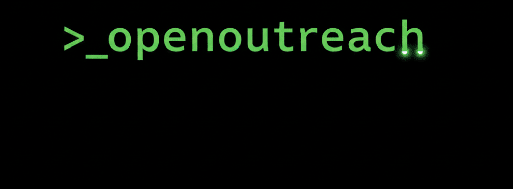

> **The open-source growth engine that puts your LinkedIn B2B lead generation on autopilot.**

<div align="center">

[](https://github.com/eracle/OpenOutreach/stargazers)
[](https://github.com/eracle/OpenOutreach/network/members)
[](https://www.gnu.org/licenses/gpl-3.0)
[](https://github.com/eracle/OpenOutreach/issues)

<br/>

# Demo:



</div>

---

### 🚀 What is OpenOutreach?

OpenOutreach is a **self-hosted, open-source LinkedIn automation tool** designed for B2B lead generation, without the
risks and costs of cloud SaaS services.

It automates the entire outreach process in a **stealthy, human-like way**:

- Discovers and enriches target profiles
- Sends personalized connection requests
- Follows up with custom messages after acceptance
- Tracks everything in a local database (full data ownership, resumable workflows)

**Why choose OpenOutreach?**

- 🛡️ **Undetectable** — Playwright + stealth plugins mimic real user behavior
- 🐍 **Fully customizable** — Python-based campaigns for unlimited flexibility
- 💾 **Local execution** — You own your workflow
- 🐳 **Easy deployment** — Dockerized, one-command setup
- ✨ **AI-ready** — Built-in templating for hyper-personalized messages (integrate GPT easily)

Perfect for founders, sales teams, and agencies who want powerful automation **without account bans or subscription
lock-in**.

---

## ⚡ Quick Start (Local Installation)

Get up and running locally in minutes to access the full visual **Web Dashboard**.

### 1. Clone the Repository
```bash
git clone https://github.com/ScooterAI2025/Scooter_Linkedin.git
cd Scooter_Linkedin
```

### 2. Set Up a Virtual Environment
It's highly recommended to use an isolated Python virtual environment securely.
```bash
python3 -m venv .venv
source .venv/bin/activate  # (On Windows use: .venv\Scripts\activate)
```

### 3. Install Dependencies
Install all the required Python packages (Pandas, Playwright, etc.) and download the secure browser engine needed for deep scraping.
```bash
pip install -r requirements/base.txt
playwright install --with-deps chromium
```

### 4. Configure Your Credentials
You need to provide your LinkedIn credentials for the bot to securely log in.
1. Create your secrets file:
   ```bash
   cp assets/accounts.secrets.template.yaml assets/accounts.secrets.yaml
   ```
2. Open `assets/accounts.secrets.yaml` in any text editor and type in your LinkedIn email and password.

### 5. Start the Web Dashboard!
Boot up the main server logic and graphic interface:
```bash
python ui_server.py
```
*Done! Open your browser and go to **`http://127.0.0.1:8000`** to access your control panel!*
---

## 🐳 Docker Installation

We also support running the application via Docker. This is a great option for ensuring a consistent environment and simplifying dependency management.

For full instructions, please see the **[Docker Installation Guide](./docs/docker.md)**.

---
## ✨ Features

| Feature                            | Description                                                                                                          |
|------------------------------------|----------------------------------------------------------------------------------------------------------------------|
| 🤖 **Advanced Browser Automation** | Powered by Playwright with stealth plugins for human-like, undetectable interactions.                                |
| 🛡️ **Reliable Data Scraping**     | Uses LinkedIn's internal Voyager API for accurate, structured profile data (no fragile HTML parsing).                |
| 🐍 **Python-Native Campaigns**     | Write flexible, powerful automation sequences directly in Python.                                                    |
| 🔄 **Stateful Workflow Engine**    | Tracks profile states (`DISCOVERED` → `ENRICHED` → `CONNECTED` → `COMPLETED`) in a local DB – resumable at any time. |
| 💾 **Persistent Local Database**   | Full data ownership via dedicated SQLite DB per account.                                                             |
| 🐳 **Containerized Setup**         | One-command Docker + Make deployment.                                                                                |
| 🖥️ **Visual Debugging**           | Real-time browser view via built-in VNC server (`localhost:5900`).                                                   |
| ✍️ **AI-Ready Templating**         | Jinja or AI-prompt templates for hyper-personalized messages (easy GPT integration).                                 |

---

### ❤️ Support OpenOutreach – Keep the Leads Flowing!

This project is built in spare time to provide powerful, **free** open-source growth tools.

Maintaining stealth, fixing bugs, adding features (multi-account scaling, better templates, AI enhancements), and
staying ahead of LinkedIn changes takes serious effort.

**Your sponsorship funds faster updates and keeps it free for everyone.**

<div align="center">

[](https://github.com/sponsors/eracle)

<br/>

**Popular Tiers & Perks:**

| Tier        | Monthly | Benefits                                                              |
|-------------|---------|-----------------------------------------------------------------------|
| ☕ Supporter | $5      | Huge thanks + name in README supporters list                          |
| 🚀 Booster  | $25     | All above + priority feature requests + early access to new campaigns |
| 🦸 Hero     | $100    | All above + personal 1-on-1 support + influence roadmap               |
| 💎 Legend   | $500+   | All above + custom feature development + shoutout in releases         |

**Thank you to all sponsors — you're powering open-source B2B growth!** 🚀

</div>

---

### 🗓️ Book a Free 15-Minute Call

Got a specific use case, feature request, or questions about setup?

Book a **free 15-minute call** — I’d love to hear your needs and improve the tool based on real feedback.

<div align="center">

[](https://calendly.com/eracle/new-meeting)

</div>

---

## 📖 Usage & Customization

The default campaign (`linkedin/campaigns/connect_follow_up.py`) handles:

- Profile enrichment
- Connection requests
- Personalized follow-ups

**Profile states:** `DISCOVERED` → `ENRICHED` → `CONNECTED` → `COMPLETED` (or `FAILED`)

Edit the campaign file directly for custom logic, templates, or AI integration.

---

## 📂 Project Structure

```
├── assets/
│   ├── accounts.secrets.yaml      # LinkedIn credentials
│   └── inputs/
│       └── urls.csv               # Target profiles
├── docs/
│   ├── docker.md                  # NEW: Docker setup guide
│   └── ...
├── linkedin/
│   ├── actions/                   # Browser actions
│   ├── api/                       # Voyager API client
│   ├── campaigns/                 # Workflows
│   ├── db/                        # SQLite utilities
│   ├── navigation/                # Login helpers
│   └── sessions/                  # Session management
├── main.py                        # Entry point
├── local.yml                      # Docker Compose
└── Makefile                       # Shortcuts
```

---

## 📚 Documentation

- [Docker Installation](./docs/docker.md)
- [Configuration](./docs/configuration.md)
- [Templating](./docs.md)
- [Testing Strategy](./docs/testing.md)

---

## 💬 Community

Join for support and discussions:  
[Telegram Group](https://t.me/+Y5bh9Vg8UVg5ODU0)

---

## ⚖️ License

[GNU GPLv3](https://www.gnu.org/licenses/gpl-3.0) — see [LICENCE.md](LICENCE.md)

---

## 📜 Legal Disclaimer

**Not affiliated with LinkedIn.**

Automation may violate LinkedIn's terms (Section 8.2). Risk of account suspension exists.

**Use at your own risk — no liability assumed.**

---

<div align="center">

**Made with ❤️**

</div>
